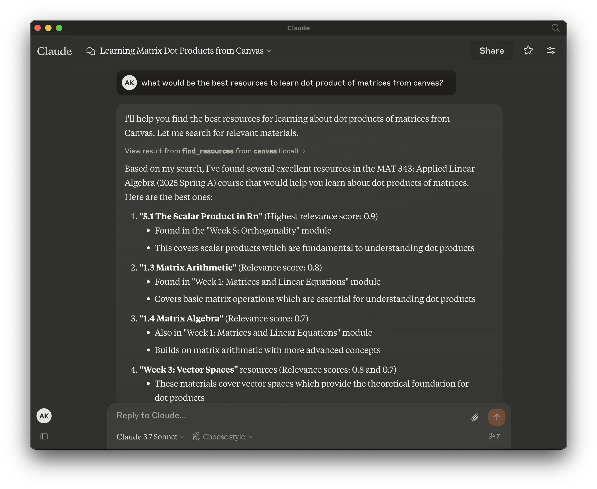

# Canvas MCP

[](https://smithery.ai/server/@aryankeluskar/canvas-mcp)

Canvas MCP is a set of tools that allows your AI agents to interact with Canvas LMS.



## Features

- **Find relevant resources** - Ability to find relevant resources for a given query in natural language!
- **Query upcoming assignments** - Not only fetch upcoming assignments, but also provide its breakdown for a given course.
- Get courses
- Get modules
- Get module items
- Get file url
- Get calendar events
- Get assignments
- and so much more... 

## Usage

Note down the following beforehand:
1. Canvas API Key from `Canvas > Account > Settings > Approved Integrations > New Access Token`

### Installing via Smithery (**Preferred**)

To install Canvas MCP for Claude Desktop automatically via [Smithery](https://smithery.ai/server/@aryankeluskar/canvas-mcp):

```bash
npx -y @smithery/cli install @aryankeluskar/canvas-mcp --client claude
```

Or, for Cursor IDE to use canvas-mcp with other models:

```bash
npx -y @smithery/cli install @aryankeluskar/canvas-mcp --client cursor
```

Or, for Windsurf:

```bash
npx -y @smithery/cli install @aryankeluskar/canvas-mcp --client windsurf
```

---


### Manual Installation (ONLY for local instances)

Download the repository and run the following commands:

```bash
git clone https://github.com/aryankeluskar/canvas-mcp.git
cd canvas-mcp

# Install dependencies with uv (recommended)
pip install uv
uv venv
source .venv/bin/activate  # On Windows: .venv\Scripts\activate
uv pip install -r requirements.txt

# Or install with pip
pip install -r requirements.txt
```

### Manual Configuration

You have two options for configuring the Canvas API key:

#### Option 1: Using Environment Variables

Create a `.env` file in the root directory with the following environment variable:

```
CANVAS_API_KEY=your_canvas_api_key
```

#### Option 2: Hard-Coding the API Key (Recommended for Personal Use)

Open `canvas.py` and set the `HARD_CODED_CANVAS_API_KEY` constant at the top of the file:

```python
# Hard-coded API key (replace with your actual API key if you don't want to use environment variables)
# If this is set, it will be used instead of looking for environment variables
HARD_CODED_CANVAS_API_KEY = "your_canvas_api_key"
```

Add the following to your `mcp.json` or `claude_desktop_config.json` file:

```json
{
  "mcpServers": {
      "canvas": {
          "command": "uv",
          "args": [
              "--directory",
              "/Users/aryank/Developer/canvas-mcp",
              "run",
              "canvas.py"
          ]
      }
  }
}
```

---

Built by [Aryan Keluskar](https://aryankeluskar.com) :)
